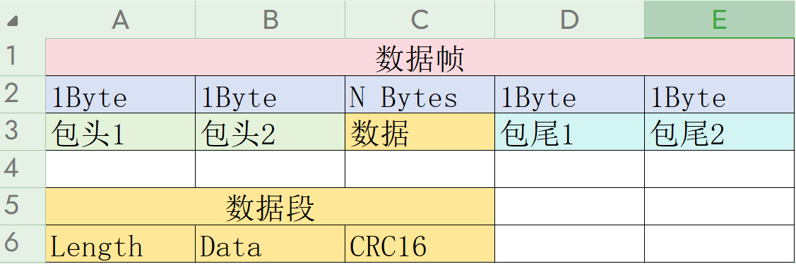

# GenericReqRespProtocol

GenericReqRespProtocol 是一个用于 Arduino 的通用请求响应协议库。该库提供了一种简单的方法来处理串口通信中的数据包解析和封装。

## 功能

- 支持自定义数据包的头部和尾部标识。
- 提供数据校验功能，确保数据的完整性和正确性。
- 支持应用层帧的编码和解码，方便数据的传输和处理。
- 提供内存管理功能，避免内存泄漏和悬挂指针。

## 安装

1. 将 `GenericReqRespProtocol` 文件夹复制到 Arduino 库文件夹中（通常是 `Arduino/libraries/`）。
2. 在 Arduino IDE 中，选择 "Sketch" > "Include Library" > "GenericReqRespProtocol"。

## 使用示例

### 初始化

在 `setup()` 函数中初始化串口和协议解析器：

```c
#include <Arduino.h>
#include "GenericReqRespProtocol.h"

void setup()
{
    Serial.begin(9600);

    // 初始化包头和包尾
    PacketEdger edger = {{0xAB, 0xCD}, {0xEF, 0x01}};

    // 创建解析器
    GenericByteParser *parser = NewGenericByteParser(SimpleDataChecker, edger);

    if (parser == NULL)
    {
        while (1)
        {
            Serial.println("Failed to create parser");
            delay(1000);
        }
    }
}
```

### 发送数据

使用 `Write()` 函数发送数据：

```c
int Write(Transport *transport, const uint8_t *data, size_t dataLength)
{
    size_t newDataLength;
    uint8_t *newData = AddPacketEdges(&(transport->parser->edger), data, dataLength, &newDataLength);
    if (newData == NULL)
    {
        return -1;
    }

    // 假设这里是你的串口写入函数，根据实际情况修改
    // int writeResult = transport->port->Write(newData, newDataLength);
    // 这里暂时使用 printf 模拟写入
    printf("Writing data: ");
    for (size_t i = 0; i < newDataLength; i++)
    {
        printf("%02X ", newData[i]);
    }
    printf("\n");

    free(newData);

    return 0;
}
```

### 接收数据

在 `loop()` 函数中接收数据并解析：

```c
void loop()
{
    static uint8_t buffer[128]; // 缓冲区，存储从串口读取的数据
    static size_t buffer_index = 0;

    if (Serial.available() > 0)
    {
        buffer[buffer_index++] = Serial.read();

        // 假设最大数据包长度为 128 字节
        if (buffer_index >= 128)
        {
            buffer_index = 0;
        }

        size_t result_length;
        uint8_t *packetData = ParseBytes(parser, buffer, buffer_index, &result_length);

        if (packetData!= NULL)
        {
            Serial.print("Received packet: ");
            for (size_t i = 0; i < result_length; i++)
            {
                Serial.print(packetData[i], HEX);
                Serial.print(" ");
            }
            Serial.println();

            // 处理接收到的数据包，例如解析其内容
            // 这里可以添加你的数据包处理逻辑

            // 释放解析结果的内存
            free(packetData);

            // 移动未处理的数据到缓冲区开头
            size_t remaining_length = buffer_index - (result_length + PACKET_HEADER_SIZE + PACKET_TAIL_SIZE);
            if (remaining_length > 0)
            {
                memmove(buffer, buffer + result_length + PACKET_HEADER_SIZE + PACKET_TAIL_SIZE, remaining_length);
            }
            buffer_index = remaining_length;
        }
    }

    delay(10);
}
```

## 贡献

欢迎提交问题和 Pull Request，共同完善这个库。

## 许可证

本项目采用 [GNU Affero General Public License v3.0](https://www.gnu.org/licenses/agpl-3.0.en.html) 许可证。